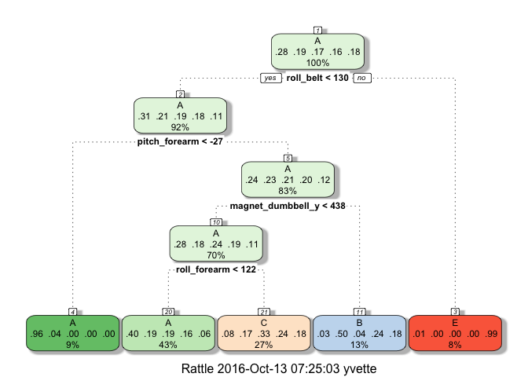

    knitr::opts_chunk$set(echo = TRUE)

Objective
---------

The dataset in this study is from accelerometers on the belt, forearm,
arm, and dumbell of 6 participants who were asked to perform barbell
lifts correctly and incorrectly in 5 different ways. The goal of this
project is to predict the manner in which they did the exercise. This is
the "classe" variable in the training set. The final model will be used
to predict 20 different test cases.

Load required packages for the prediction

    library(AppliedPredictiveModeling)
    library(caret)

    ## Warning: package 'caret' was built under R version 3.2.5

    ## Loading required package: lattice

    ## Loading required package: ggplot2

    library(rpart)
    library(rpart.plot)

    ## Warning: package 'rpart.plot' was built under R version 3.2.5

    library(rattle)

    ## R session is headless; GTK+ not initialized.

    ## Rattle: A free graphical interface for data mining with R.
    ## Version 4.1.0 Copyright (c) 2006-2015 Togaware Pty Ltd.
    ## Type 'rattle()' to shake, rattle, and roll your data.

    library(randomForest)

    ## randomForest 4.6-12

    ## Type rfNews() to see new features/changes/bug fixes.

    ## 
    ## Attaching package: 'randomForest'

    ## The following object is masked from 'package:ggplot2':
    ## 
    ##     margin

    library(gbm)

    ## Loading required package: survival

    ## 
    ## Attaching package: 'survival'

    ## The following object is masked from 'package:caret':
    ## 
    ##     cluster

    ## Loading required package: splines

    ## Loading required package: parallel

    ## Loaded gbm 2.1.1

    library(plyr)

Load datasets for training and final dataset for 20 test cases

    fileUrl_train<-"https://d396qusza40orc.cloudfront.net/predmachlearn/pml-training.csv"
    download.file(fileUrl_train,destfile="./train4.csv",method="curl")
    data_train = read.csv("~/train4.csv", na.strings=c("NA","") , header=TRUE)

    fileUrl_test<-"https://d396qusza40orc.cloudfront.net/predmachlearn/pml-testing.csv"
    download.file(fileUrl_test,destfile="./test4.csv",method="curl")
    data_test = read.csv("~/test4.csv", na.strings=c("NA","") , header=TRUE)

60% of the original train set is being used as test set and the rest is
used as validation set

    # create a partition with the training dataset 
    inTrain  <- createDataPartition(data_train$classe, p=0.6, list=FALSE)
    TrainSet <- data_train[inTrain, ]
    TestSet  <- data_train[-inTrain, ]
    dim(TrainSet)

    ## [1] 11776   160

    dim(TestSet)

    ## [1] 7846  160

Clean up data set by omitting all the columns with mainly zero values,
NAs or not for predication use.

    NZero <- nearZeroVar(TrainSet)
    TrainSet <- TrainSet[, -NZero]
    TestSet  <- TestSet[, -NZero]
    dim(TrainSet)

    ## [1] 11776   121

    dim(TestSet)

    ## [1] 7846  121

    NAOBS   <- sapply(TrainSet, function(x) mean(is.na(x))) > 0.9
    TrainSet <- TrainSet[, NAOBS==FALSE]
    TestSet  <- TestSet[, NAOBS==FALSE]
    TrainSet <- TrainSet[, -(1:6)]
    TestSet <- TestSet[, -(1:6)]
    dim(TrainSet)

    ## [1] 11776    53

    dim(TestSet)

    ## [1] 7846   53

    #Check that the columns matches for the training and validation sets
    colnames(TrainSet)

    ##  [1] "roll_belt"            "pitch_belt"           "yaw_belt"            
    ##  [4] "total_accel_belt"     "gyros_belt_x"         "gyros_belt_y"        
    ##  [7] "gyros_belt_z"         "accel_belt_x"         "accel_belt_y"        
    ## [10] "accel_belt_z"         "magnet_belt_x"        "magnet_belt_y"       
    ## [13] "magnet_belt_z"        "roll_arm"             "pitch_arm"           
    ## [16] "yaw_arm"              "total_accel_arm"      "gyros_arm_x"         
    ## [19] "gyros_arm_y"          "gyros_arm_z"          "accel_arm_x"         
    ## [22] "accel_arm_y"          "accel_arm_z"          "magnet_arm_x"        
    ## [25] "magnet_arm_y"         "magnet_arm_z"         "roll_dumbbell"       
    ## [28] "pitch_dumbbell"       "yaw_dumbbell"         "total_accel_dumbbell"
    ## [31] "gyros_dumbbell_x"     "gyros_dumbbell_y"     "gyros_dumbbell_z"    
    ## [34] "accel_dumbbell_x"     "accel_dumbbell_y"     "accel_dumbbell_z"    
    ## [37] "magnet_dumbbell_x"    "magnet_dumbbell_y"    "magnet_dumbbell_z"   
    ## [40] "roll_forearm"         "pitch_forearm"        "yaw_forearm"         
    ## [43] "total_accel_forearm"  "gyros_forearm_x"      "gyros_forearm_y"     
    ## [46] "gyros_forearm_z"      "accel_forearm_x"      "accel_forearm_y"     
    ## [49] "accel_forearm_z"      "magnet_forearm_x"     "magnet_forearm_y"    
    ## [52] "magnet_forearm_z"     "classe"

    colnames(TestSet)

    ##  [1] "roll_belt"            "pitch_belt"           "yaw_belt"            
    ##  [4] "total_accel_belt"     "gyros_belt_x"         "gyros_belt_y"        
    ##  [7] "gyros_belt_z"         "accel_belt_x"         "accel_belt_y"        
    ## [10] "accel_belt_z"         "magnet_belt_x"        "magnet_belt_y"       
    ## [13] "magnet_belt_z"        "roll_arm"             "pitch_arm"           
    ## [16] "yaw_arm"              "total_accel_arm"      "gyros_arm_x"         
    ## [19] "gyros_arm_y"          "gyros_arm_z"          "accel_arm_x"         
    ## [22] "accel_arm_y"          "accel_arm_z"          "magnet_arm_x"        
    ## [25] "magnet_arm_y"         "magnet_arm_z"         "roll_dumbbell"       
    ## [28] "pitch_dumbbell"       "yaw_dumbbell"         "total_accel_dumbbell"
    ## [31] "gyros_dumbbell_x"     "gyros_dumbbell_y"     "gyros_dumbbell_z"    
    ## [34] "accel_dumbbell_x"     "accel_dumbbell_y"     "accel_dumbbell_z"    
    ## [37] "magnet_dumbbell_x"    "magnet_dumbbell_y"    "magnet_dumbbell_z"   
    ## [40] "roll_forearm"         "pitch_forearm"        "yaw_forearm"         
    ## [43] "total_accel_forearm"  "gyros_forearm_x"      "gyros_forearm_y"     
    ## [46] "gyros_forearm_z"      "accel_forearm_x"      "accel_forearm_y"     
    ## [49] "accel_forearm_z"      "magnet_forearm_x"     "magnet_forearm_y"    
    ## [52] "magnet_forearm_z"     "classe"

I plan on building the prediction model with trees , random forest and
boosting with trees. I will pick the final model with the highest
accuracy after predicting each model with the validation set. I
originally used the entire dataset to run, but it took a long time, I
decided to use a subset of the traing set to come up with model. Since
in the end, the best model accuracy turned out to be high, I did not
increase my training sample size.

The accuracy of random forest prediction is 0.9936

    set.seed(2345)
    fitRF <- train(classe ~ ., data=TrainSet,method="rf",trControl=trainControl(method="cv", number=3))
    predRF<- predict(fitRF, TestSet)
    print(confusionMatrix(predRF, TestSet$classe))

    ## Confusion Matrix and Statistics
    ## 
    ##           Reference
    ## Prediction    A    B    C    D    E
    ##          A 2230   11    0    0    0
    ##          B    0 1499    6    0    0
    ##          C    1    8 1357   19    0
    ##          D    0    0    5 1264    6
    ##          E    1    0    0    3 1436
    ## 
    ## Overall Statistics
    ##                                           
    ##                Accuracy : 0.9924          
    ##                  95% CI : (0.9902, 0.9942)
    ##     No Information Rate : 0.2845          
    ##     P-Value [Acc > NIR] : < 2.2e-16       
    ##                                           
    ##                   Kappa : 0.9903          
    ##  Mcnemar's Test P-Value : NA              
    ## 
    ## Statistics by Class:
    ## 
    ##                      Class: A Class: B Class: C Class: D Class: E
    ## Sensitivity            0.9991   0.9875   0.9920   0.9829   0.9958
    ## Specificity            0.9980   0.9991   0.9957   0.9983   0.9994
    ## Pos Pred Value         0.9951   0.9960   0.9798   0.9914   0.9972
    ## Neg Pred Value         0.9996   0.9970   0.9983   0.9967   0.9991
    ## Prevalence             0.2845   0.1935   0.1744   0.1639   0.1838
    ## Detection Rate         0.2842   0.1911   0.1730   0.1611   0.1830
    ## Detection Prevalence   0.2856   0.1918   0.1765   0.1625   0.1835
    ## Balanced Accuracy      0.9986   0.9933   0.9938   0.9906   0.9976

The accuracy of tree prediction is 0.494. As expected, this is a poorer
prediction than random forest.

    set.seed(2345)
    Fitrpart <- train(classe ~ ., data = TrainSet, method="rpart")
    print(Fitrpart$finalModel)

    ## n= 11776 
    ## 
    ## node), split, n, loss, yval, (yprob)
    ##       * denotes terminal node
    ## 
    ##  1) root 11776 8428 A (0.28 0.19 0.17 0.16 0.18)  
    ##    2) roll_belt< 130.5 10784 7447 A (0.31 0.21 0.19 0.18 0.11)  
    ##      4) pitch_forearm< -26.65 1047   42 A (0.96 0.04 0 0 0) *
    ##      5) pitch_forearm>=-26.65 9737 7405 A (0.24 0.23 0.21 0.2 0.12)  
    ##       10) magnet_dumbbell_y< 438.5 8213 5931 A (0.28 0.18 0.24 0.19 0.11)  
    ##         20) roll_forearm< 121.5 5036 2997 A (0.4 0.19 0.19 0.16 0.063) *
    ##         21) roll_forearm>=121.5 3177 2128 C (0.076 0.17 0.33 0.24 0.18) *
    ##       11) magnet_dumbbell_y>=438.5 1524  762 B (0.033 0.5 0.045 0.24 0.18) *
    ##    3) roll_belt>=130.5 992   11 E (0.011 0 0 0 0.99) *

    fancyRpartPlot(Fitrpart$finalModel)

<!-- -->

    predRpart <- predict(Fitrpart, TestSet)
    print(confusionMatrix(predRpart , TestSet$classe))

    ## Confusion Matrix and Statistics
    ## 
    ##           Reference
    ## Prediction    A    B    C    D    E
    ##          A 2044  640  646  615  203
    ##          B   34  511   41  209  209
    ##          C  151  367  681  462  380
    ##          D    0    0    0    0    0
    ##          E    3    0    0    0  650
    ## 
    ## Overall Statistics
    ##                                           
    ##                Accuracy : 0.4953          
    ##                  95% CI : (0.4842, 0.5064)
    ##     No Information Rate : 0.2845          
    ##     P-Value [Acc > NIR] : < 2.2e-16       
    ##                                           
    ##                   Kappa : 0.3395          
    ##  Mcnemar's Test P-Value : NA              
    ## 
    ## Statistics by Class:
    ## 
    ##                      Class: A Class: B Class: C Class: D Class: E
    ## Sensitivity            0.9158  0.33663   0.4978   0.0000  0.45076
    ## Specificity            0.6252  0.92209   0.7901   1.0000  0.99953
    ## Pos Pred Value         0.4928  0.50896   0.3337      NaN  0.99541
    ## Neg Pred Value         0.9492  0.85282   0.8817   0.8361  0.88989
    ## Prevalence             0.2845  0.19347   0.1744   0.1639  0.18379
    ## Detection Rate         0.2605  0.06513   0.0868   0.0000  0.08284
    ## Detection Prevalence   0.5287  0.12796   0.2601   0.0000  0.08323
    ## Balanced Accuracy      0.7705  0.62936   0.6439   0.5000  0.72515

The accuracy of boosting with trees prediction is 0.9625 which is an
improvement from classification trees but not as good as random forest
prediction.

    set.seed(2345)
    fitgbm <- train(classe~ ., data=TrainSet,method="gbm",trControl=trainControl(method="repeatedcv",number=5,repeats=1),verbose=FALSE)
    predgbm <- predict(fitgbm , TestSet)
    print(confusionMatrix(predgbm, TestSet$classe))

    ## Confusion Matrix and Statistics
    ## 
    ##           Reference
    ## Prediction    A    B    C    D    E
    ##          A 2193   52    0    3    2
    ##          B   24 1424   35    6   14
    ##          C    8   39 1319   46   12
    ##          D    3    0   12 1226   13
    ##          E    4    3    2    5 1401
    ## 
    ## Overall Statistics
    ##                                           
    ##                Accuracy : 0.9639          
    ##                  95% CI : (0.9596, 0.9679)
    ##     No Information Rate : 0.2845          
    ##     P-Value [Acc > NIR] : < 2.2e-16       
    ##                                           
    ##                   Kappa : 0.9544          
    ##  Mcnemar's Test P-Value : 9.999e-10       
    ## 
    ## Statistics by Class:
    ## 
    ##                      Class: A Class: B Class: C Class: D Class: E
    ## Sensitivity            0.9825   0.9381   0.9642   0.9533   0.9716
    ## Specificity            0.9898   0.9875   0.9838   0.9957   0.9978
    ## Pos Pred Value         0.9747   0.9474   0.9263   0.9777   0.9901
    ## Neg Pred Value         0.9930   0.9852   0.9924   0.9909   0.9936
    ## Prevalence             0.2845   0.1935   0.1744   0.1639   0.1838
    ## Detection Rate         0.2795   0.1815   0.1681   0.1563   0.1786
    ## Detection Prevalence   0.2868   0.1916   0.1815   0.1598   0.1803
    ## Balanced Accuracy      0.9862   0.9628   0.9740   0.9745   0.9847

Since random forest prediction has the highest accuracy of 0.9936, it is
used to predict the 20 test case and here is the result.

    print(predict(fitRF,data_test))

    ##  [1] B A B A A E D B A A B C B A E E A B B B
    ## Levels: A B C D E
